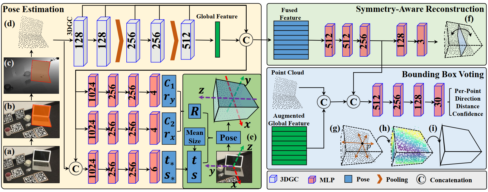

# GPV-Pose
Pytorch implementation of GPV-Pose: Category-level Object Pose Estimation via Geometry-guided Point-wise Voting.
([link](https://arxiv.org/abs/2203.07918))



## UPDATE!
A new version of code which integrates shape prior information has been updated to the shape-prior-integrated branch in this repo!
A brief introuction will be presented in this file.

## Required environment

- Ubuntu 18.04
- Python 3.8 
- Pytorch 1.10.1
- CUDA 11.3.
 


## Installing

- Install the main requirements in 'requirement.txt'.
- Install [Detectron2](https://github.com/facebookresearch/detectron2).

## Data Preparation
To generate your own dataset, use the data preprocess code provided in this [git](https://github.com/mentian/object-deformnet/blob/master/preprocess/pose_data.py).
Download the detection results in this [git](https://github.com/Gorilla-Lab-SCUT/DualPoseNet).


## Trained model
Download the trained model from this [link](https://drive.google.com/file/d/1V3kkJNHAkr5ZiBO-pxNeujDUA--GRfT7/view?usp=sharing).

## Training
Please note, some details are changed from the original paper for more efficient training. 

Specify the dataset directory and run the following command.
```shell
python -m engine.train --data_dir YOUR_DATA_DIR --model_save SAVE_DIR
```

Detailed configurations are in 'config/config.py'.

## Evaluation
```shell
python -m evaluation.evaluate --data_dir YOUR_DATA_DIR --detection_dir DETECTION_DIR --resume 1 --resume_model MODEL_PATH --model_save SAVE_DIR
```


## Acknowledgment
Our implementation leverages the code from [3dgcn](https://github.com/j1a0m0e4sNTU/3dgcn), [FS-Net](https://github.com/DC1991/FS_Net),
[DualPoseNet](https://github.com/Gorilla-Lab-SCUT/DualPoseNet), [SPD](https://github.com/mentian/object-deformnet).
